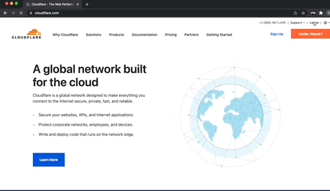
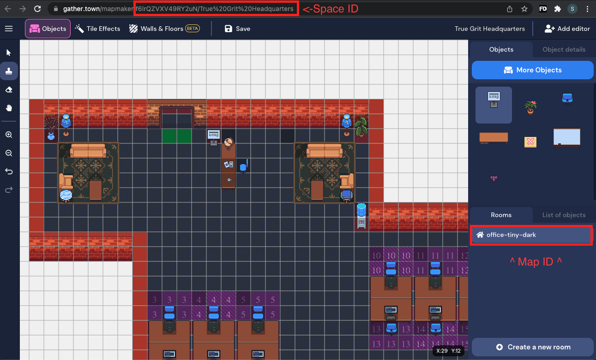

# 👷 gather.town Scheduler

Small cloudflare worker to allow you to set a Google Hangout ID for a corresponding hangout object in gather.town. 

Cloudflare was chosen partially as a proof of concept, but mostly because [limitations on free workers](https://developers.cloudflare.com/workers/platform/limits) are far beyond what this will likely use. 

## Some Light Reading
* [Gather HTTP API Documentation](https://www.notion.so/Gather-HTTP-API-3bbf6c59325f40aca7ef5ce14c677444)
* [Cloudflare Workers Documentation](https://developers.cloudflare.com/workers/)

## Configuration
Deployment is handled by [Wrangler](https://developers.cloudflare.com/workers/cli-wrangler/authentication) and requires you to sign up for a free cloudflare account. 

Once you've got your cloudflare account set up, installing wrangler is straightforward, just
```shell
npm i @cloudflare/wrangler -g
```

After that a simple `wrangler login` will take care of the authentication for you
```
gathertown-scheduler % wrangler login
Allow Wrangler to open a page in your browser? [y/n]
y
💁  Opened a link in your default browser: https://dash.cloudflare.com/oauth2/auth?response_type=code&client_id=████████-████-████-████-█████████&state=████-██████████&code_challenge=███████████████████████████████████████████&code_challenge_method=S256&redirect_uri=http%3A%2F%2Flocalhost%3A8976%2Foauth%2Fcallback&scope=account%3Aread+user%3Aread+workers%3Awrite+workers_kv%3Awrite+workers_routes%3Awrite+workers_scripts%3Awrite+workers_tail%3Aread+zone%3Aread+offline_access
✨  Successfully configured. You can find your configuration file at: /Users/samheller/.wrangler/config/default.toml
```

### `wrangler.toml`
In order to hook this up to a cloudflare worker you need to update the wrangler.toml file with your account ID. Since this isn't running on a managed domain, you're free to delete the `route` and `zone_id` keys.

Check out Cloudflares [Getting Started Guide](https://developers.cloudflare.com/workers/get-started/guide) for more specifics and context.

### Cloudflare Configuration
The beginning of your wrangler.toml should look something like this. You can get the ID for your KV binding from the same page where you created it initially
```
name = "your-apps-name"
type = "javascript"
account_id = "ThisIsMyAccountIdYouCantHaveIt"
workers_dev = true
compatibility_date = "2021-12-13"

kv_namespaces = [
    {binding = "MEETINGS", id="fb003337b1bb43ff8af1ac9cecd24744"}
]

```

If you haven't already, login to Cloudflare and set up a Worker KV store and make a copy of the ID for use in the kv_namespaces binding. 

 


### Local Variables
Local variables are also configured in the `wrangler.toml` file under the `[vars]` section. You'll need to :
1. Get an API key by going to [https://gather.town/apiKeys](https://gather.town/apiKeys) and generating one
2. Copy the Space ID from the gather.town map editor url, replacing any %20 encoded characters with spaces and reversing the last seperating `/` to a `\\`. From the screenshot below the value `f6lrQZVXV49RY2uN/True%20Grit%20Headquarters` becomes `f6lrQZVXV49RY2uN\True Grit Headquarters`
3. Copy the Map ID from the space name underneath the rooms tab, this is `office-tiny-dark` in the example below.
4. Choose a unique identifier that will be used to determine which meeting launcher we want to update.

```
[vars]
GATHER_MAP_ID = "office-tiny-dark"
GATHER_SPACE_ID = "f6lrQZVXV49RY2uN\True Grit Headquarters"
HANGOUT_KEY = "Unique-Hangout-Identifier"
GATHER_GET_ENDPOINT = "https://gather.town/api/getMap"
GATHER_PUT_ENDPOINT = "https://gather.town/api/setMap"
```

 

### Gather API Key

To avoid storing the [gather api key](https://gather.town/apiKeys) in a config file, we can make use of [wranglers secrets store](https://developers.cloudflare.com/workers/cli-wrangler/commands#secret) to securely store it while allowing our application to access it at need. 
```
gathertown-scheduler % wrangler secret put GATHER_API_KEY
Enter the secret text you'd like assigned to the variable GATHER_API_KEY on the script named gathertown-scheduler:
████████████████
🌀  Creating the secret for script name gathertown-scheduler
✨  Success! Uploaded secret GATHER_API_KEY.
```


### Configuration Object
In your Gather room you'll want to create an object with an embedded website interaction that you'll update later with your worker URL

 

### Google Hangout Object
Finally you need to create the hangout object and set the `Prompt Message` in advanced options to match whatever you've chosen for your `HANGOUT_KEY`

 

## Deployment

Now that everything is configured, deploy with `wrangler publish` like so 

```
gathertown-scheduler % wrangler publish
✨  Basic JavaScript project found. Skipping unnecessary build!
✨  Successfully published your script to
 https://gathertown-scheduler.inkr.workers.dev

gathertown-scheduler % 
```
Take the URL from the publish output, and paste it into the Gather configuration object you created earlier, and you're good to go!

## Usage


Usage is pretty straightforward. Go to the first object you created, press x to interact, enter the meeting ID, and close out of the window once it's completed. Then just walk over to the hangout object, interact, and launch the meeting. 

 
